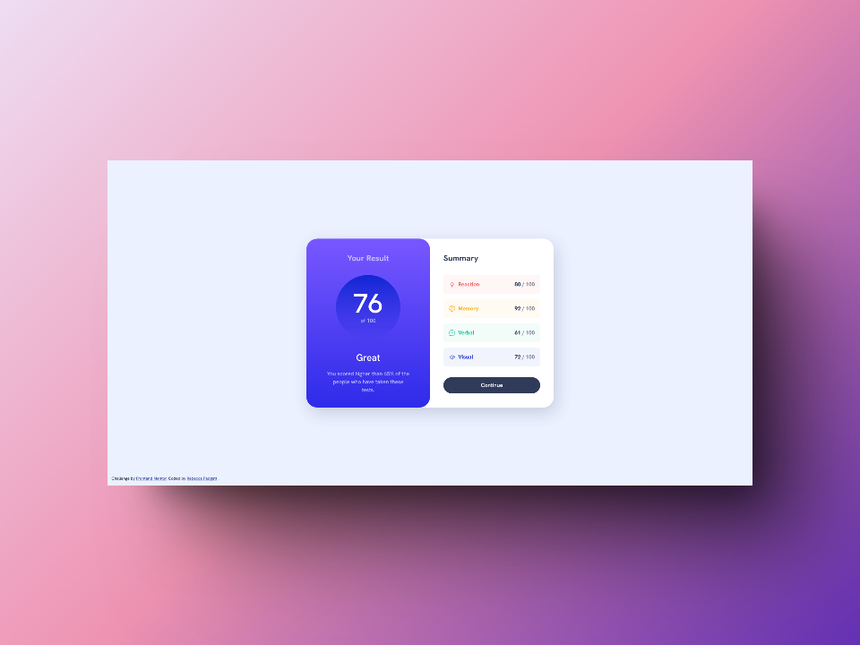

# Frontend Mentor - Results summary component solution

This is a solution to the [Results summary component challenge on Frontend Mentor](https://www.frontendmentor.io/challenges/results-summary-component-CE_K6s0maV). Frontend Mentor challenges help you improve your coding skills by building realistic projects.

## Table of contents

- [Overview](#overview)
  - [The challenge](#the-challenge)
  - [Screenshot](#screenshot)
  - [Links](#links)
- [My process](#my-process)
  - [Built with](#built-with)
  - [What I learned](#what-i-learned)
  - [Continued development](#continued-development)
  - [Useful resources](#useful-resources)
- [Author](#author)
- [Acknowledgments](#acknowledgments)

## Overview

### The challenge

Users should be able to:

- View the optimal layout for the interface depending on their device's screen size
- See hover and focus states for all interactive elements on the page

### Screenshot

### Links

- Solution URL: [Frontend Mentor](https://www.frontendmentor.io/solutions/results-summary-component-using-html-and-scss-lOHoBhuK1l)
- Live Site URL: [Github Pages](https://bccpadge.github.io/results-summary-component/)

## My process

### Built with

- Semantic HTML5 markup
- CSS custom properties
- Flexbox
- CSS Grid
- Mobile-first workflow
- SCSS
  - I used the Visual Studio Code extension Live Sass Compiler by Glenn Marks to compile my SCSS to CSS.

### What I learned

I learned structuring your HTML with the BEM methodology makes it more readable.

### Continued development

I want to continue using the BEM methodology in future projects.

### Useful resources

- [BEM website](https://getbem.com/)
- [Shots](https://shots.so/) - Create amazing mockups in seconds

## Author

- Frontend Mentor - [@bccpadge](https://www.frontendmentor.io/profile/bccpadge)
- Github - [@bccpadge](https://www.github/bccpadge)

## Acknowledgments

I started doing this project following along with Kevin Powell's Youtube tutorial at first. I decided to challenge myself by doing this project with SCSS and using the BEM methodology.
